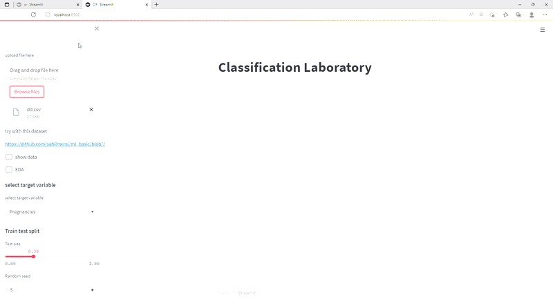

# Classification Laboratory 📉

The Classification Laboratory is a dynamic model that accepts csv data from users for classification issues with a binary outcome as the dependent variable.

This laboratory assists users in gaining insight into data, and users will receive an EDA report📑 based on pandas profiling of the file they provide.

A classifier manager aids in the management of various machine learning algorithms and the selection of the most appropriate parameters for all models.Deploy a classification laboratory using streamlit

.

What you will explore in this classification laboratory

- **EDA report**

- **Train Test split** 

- **Feature Engineering**

    - PCA 

- **Machine Learining models**

   - K Nearest neighbour

   - Logistic Regression

   - Decision Tree

   - Random Forest Classifier

   - AdaBoostClassifier

   - GradientBoostingclassifier

- **You will obtain the following outcomes:👇**

  -Variance bias tradoff

  -Classification Report

  -Confusion Metrix

  -Mcnemar test 

  -ROC Curve 

  -Best Parameter

  


## Demo



## Installation
You need these dependencies:
```console
pip install streamlit
```
Pandas profiling
```console
pip install pandas-profiling
```
To install mlxtend, just execute
```console
pip install mlxtend  
```
plotly 5.7.0
```console
pip install plotly
```
**website:**
https://classification-laboratory-app.herokuapp.com/
